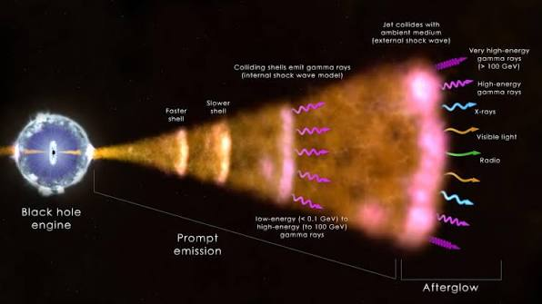
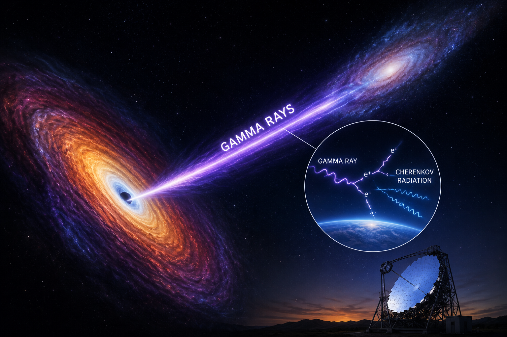

# Dumbass Machine Learning Model

This project is a simple ("dumbass") machine learning model built for binary classification using the **MAGIC Gamma Telescope (MAGIC04)** dataset.

The MAGIC04 dataset contains observations collected by the **Major Atmospheric Gamma Imaging Cherenkov (MAGIC) Telescope**. Instead of capturing gamma rays directly, the telescope records the **Cherenkov radiation** produced when high-energy gamma rays interact with Earth's atmosphere. From these observations, several numerical features are extracted and used to distinguish **gamma-ray events** from **hadronic (background) events**.

## Why Gamma-Ray Detection Matters

Gamma rays are among the highest-energy forms of electromagnetic radiation and provide valuable information about some of the most energetic phenomena in the universe, including supernova remnants, pulsars, black holes, and active galactic nuclei. Accurate gamma-ray classification helps astronomers filter background noise, improve observational accuracy, and gain a better understanding of high-energy astrophysical processes.

## Dataset

* **Dataset:** MAGIC Gamma Telescope Dataset (MAGIC04)
* **Task:** Binary Classification
* **Classes:**

  * **Gamma:** Gamma-ray induced events
  * **Hadron:** Cosmic-ray (background) events

The goal of this project is to train a machine learning model capable of distinguishing gamma-ray events from hadronic background events based on the extracted telescope features.
